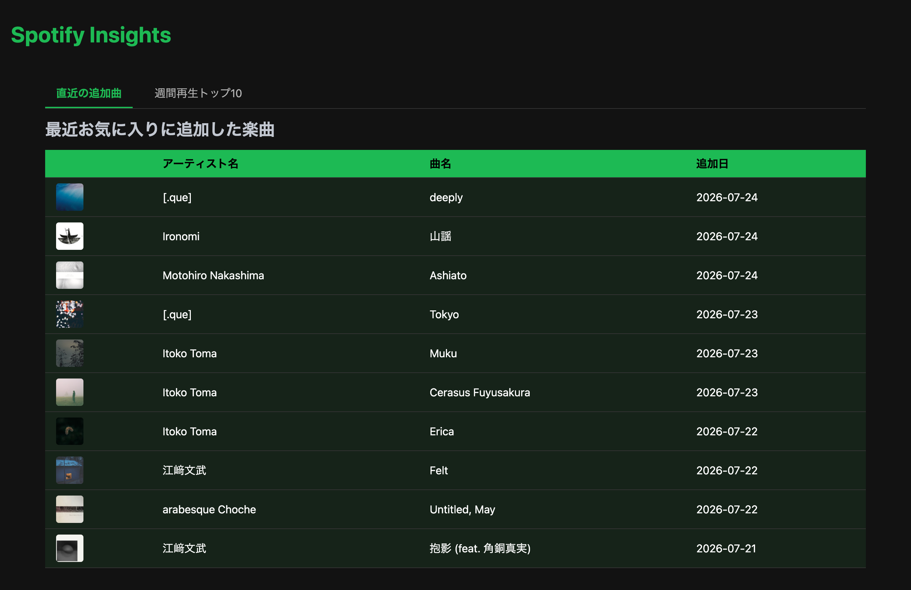
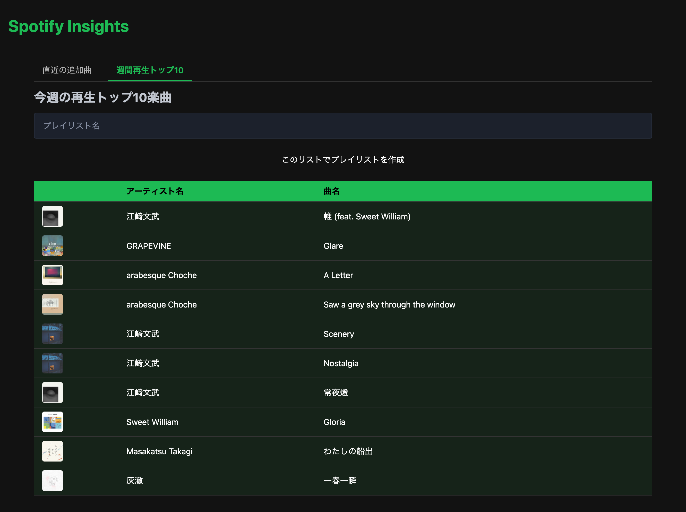

# Spotify Insights

Python学習を目的として開発した、Spotifyライブラリ・ブラウザです。

Python3エンジニア認定実践試験の学習範囲を、Spotify API・Webフロントエンド・自動テストを利用した実践的なアプリケーション開発を通して体系的に学ぶことを目的として作成しました。

---

## 概要

Spotifyのライブラリに保存した楽曲を「直近の追加曲」と「週間再生トップ10」の2つのタブで整理し、効率的にブラウジングするWebアプリケーションです。

FastHTMLを用いた非同期Web UI、htmxによる操作、Spotify API連携、ロギング、GitHub ActionsによるCI環境を実装しています。「週間再生トップ10」タブでは、抽出した楽曲からSpotify上に直接新しいプレイリストを作成可能です。

責務分離（Service・Repository）、型ヒントによる静的解析、Ruffによるコード品質管理を採用し、保守性・拡張性を意識した設計を行いました。

---

## 主な機能

* Spotify API（OAuth 2.0認可フロー）連携
* **タブ切り替え UI:** 「直近の追加曲」と「週間再生トップ10」の表示切り替え
* 楽曲情報の詳細表示（アルバムジャケットの動的描画）
* **プレイリスト自動生成:** 「週間再生トップ10」からの新規プレイリスト作成
* FastHTML/htmxによるリロード不要な非同期UI
* loggingによる詳細なログ出力
* デコレータによる処理時間計測
* GitHub ActionsによるCI環境

---

## Screenshots

### Main Window




---

## 使用技術

| 分類 | 技術 |
| --- | --- |
| Language | Python 3.13 |
| Web Framework | FastHTML |
| Package Management | uv |
| API Client | Spotipy |
| UI | Pico CSS |
| Testing | Pytest |
| Linter/Formatter | Ruff |
| Type Check | Mypy |
| CI/CD | GitHub Actions |

---

## ディレクトリ構成

```text
Python-Spotify-Insights-main/
├── LICENSE
├── README.md
├── pyproject.toml
├── uv.lock
├── docs/
│   ├── images/
│   │   ├── main1.png
│   │   └── main2.png
│   ├── requirements_definition.md
│   ├── screen_transition.md
│   └── model_design.md
├── logs/                 # 実行ログ
├── src/
│   └── track_element_app/
│       ├── __init__.py
│       ├── main.py       # CLI版エントリーポイント
│       ├── config/       # 設定管理（Logging）
│       │   └── logging_config.py
│       ├── gui/          # FastHTMLルーティング・UI
│       │   └── app.py    # Webアプリ版エントリーポイント
│       ├── models/       # データクラス
│       │   └── track.py
│       ├── services/     # API通信・分析ロジック
│       │   ├── spotify_client.py
│       │   └── track_analyzer.py
│       └── utils/        # デコレータ・共通ツール
│           ├── decorators.py
│           └── logger.py
└── tests/                # テストコード
    ├── conftest.py
    ├── test_logic_and_gui.py
    └── test_track.py
```

---

## インストールと起動

### インストール

```bash
git clone <repository-url>
cd Python-Spotify-Insights-main

uv sync
```

## Spotify Developer App の作成

本アプリを利用するには、Spotify Developer App を作成する必要があります。

1. Spotify for Developers にアクセス
https://developer.spotify.com/
2. 「Create App」をクリック
3. App Name と App Description を入力
4. Redirect URI を登録
   - http://127.0.0.1:5001/
5. Client ID と Client Secret を取得
6. `.env` に設定

### 環境変数設定

プロジェクトルートに `.env` を作成し、以下を設定してください。

```env
SPOTIPY_CLIENT_ID=your_client_id
SPOTIPY_CLIENT_SECRET=your_client_secret
SPOTIPY_REDIRECT_URI=http://127.0.0.1:5001/

```

### 起動方法

Webアプリケーション（FastHTMLダッシュボード）を起動する場合：

```bash
uv run python src/track_element_app/gui/app.py
```
起動後、ブラウザで http://127.0.0.1:5001/ にアクセスしてください。

---

## 学習テーマ

* **Python基礎:** dataclass, logging, pathlib, 例外処理
* **Web開発:** FastHTML, htmx, Pico CSS, 非同期レスポンス
* **品質管理:** pytest, unittest.mock, Ruff, Mypy, GitHub Actions
* **設計手法:** 責務分離, コンポジション, 型ヒントによる静的解析

---

## License

MIT License
