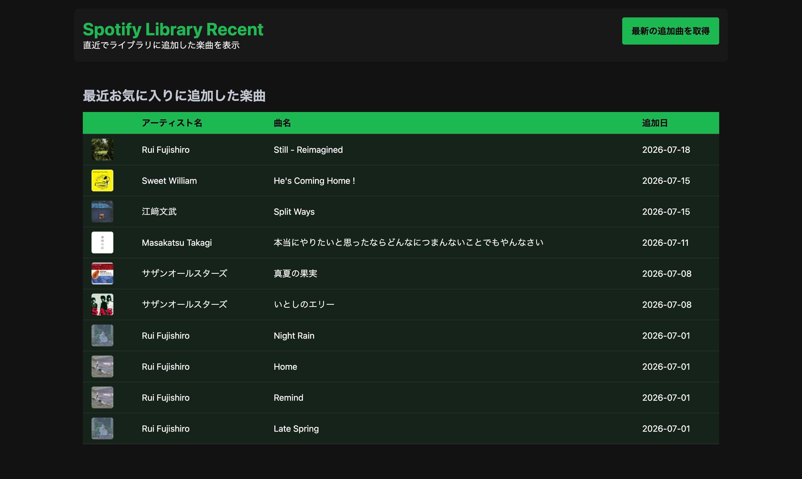

# Spotify Library Recent

Python学習を目的として開発した、Spotifyライブラリの最新状況確認アプリケーションです。

Python3エンジニア認定実践試験の学習範囲を、Spotify API・Webフロントエンド・自動テストを利用した実践的なアプリケーション開発を通して体系的に学ぶことを目的として作成しました。

---

## 概要

Spotifyのライブラリに直近で保存した楽曲をスッキリと一覧表示し、自分の「今の音楽の入り口」を確認するためのWebアプリケーションです。

FastHTMLを用いた非同期Web UI、htmxによる操作、Spotify API連携、ロギング、GitHub ActionsによるCI環境を実装しています。

責務分離（Service・Repository）、型ヒントによる静的解析、Ruffによるコード品質管理を採用し、保守性・拡張性を意識した設計を行いました。

---

## 主な機能

* Spotify API（OAuth 2.0認可フロー）連携
* 直近ライブラリ追加楽曲の取得・表示
* アルバムジャケットの動的描画
* ユーザーのお気に入り楽曲分析
* FastHTML/htmxによるリロード不要な非同期UI
* loggingによる詳細なログ出力
* デコレータによる処理時間計測
* GitHub ActionsによるCI環境

---

## Screenshots

### Main Window



---

## 使用技術

| 分類 | 技術 |
| --- | --- |
| Language | Python 3.13 |
| Web Framework | FastHTML |
| Package Management | uv |
| API Client | Spotipy |
| UI | Pico CSS |
| Testing | Pytest |
| Linter/Formatter | Ruff |
| Type Check | Mypy |
| CI/CD | GitHub Actions |

---

## ディレクトリ構成

```text
python-track-element-app/
├── src/track_element_app/
│   ├── config/       # 設定管理（Logging）
│   ├── gui/          # FastHTMLルーティング・UI
│   ├── models/       # データクラス（TrackData）
│   ├── services/     # API通信・分析ロジック
│   └── utils/        # デコレータ・共通ツール
├── tests/            # テストコード
├── docs/             # ドキュメント
└── logs/             # 実行ログ

```

---

## インストールと起動

### インストール

```bash
git clone <repository-url>
cd python-track-element-app

uv sync

```

### 環境変数設定

プロジェクトルートに `.env` を作成し、以下を設定してください。

```env
SPOTIPY_CLIENT_ID=your_client_id
SPOTIPY_CLIENT_SECRET=your_client_secret
SPOTIPY_REDIRECT_URI=http://localhost:5001/callback

```

### 起動方法

```bash
uv run python src/track_element_app/main.py

```

---

## 学習テーマ

* **Python基礎:** dataclass, logging, pathlib, 例外処理
* **Web開発:** FastHTML, htmx, Pico CSS, 非同期レスポンス
* **品質管理:** pytest, unittest.mock, Ruff, Mypy, GitHub Actions
* **設計手法:** 責務分離, コンポジション, 型ヒントによる静的解析

---

## License

MIT License
