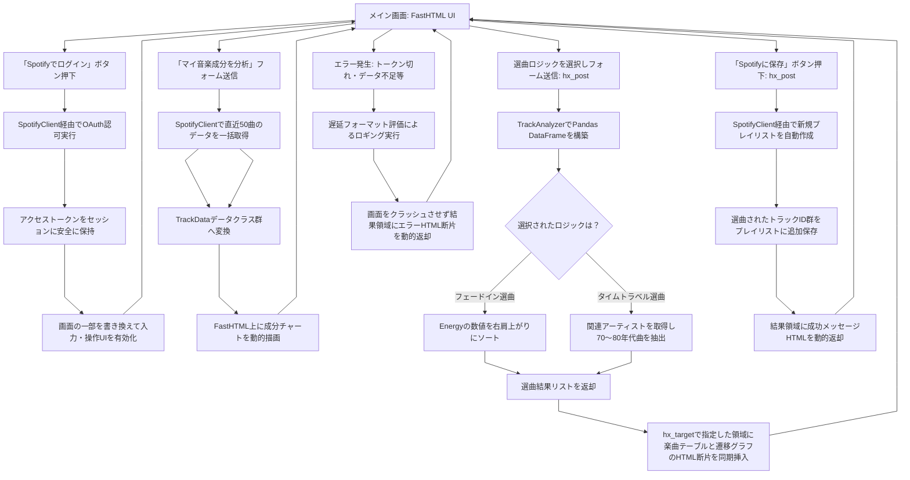

# 画面遷移・処理フロー図

メイン画面（FastHTML）を中心に、htmxを用いた部分非同期通信、データ分析、選曲ロジック適用、グラフ可視化、およびSpotify書き出しの処理フローです。

```mermaid
%%{init: {'flowchart': {'curve': 'linear'}}}%%
flowchart TD
    A[メイン画面: FastHTML UI]

    A --> B[「Spotifyでログイン」ボタン押下]
    B --> C[SpotifyClient経由でOAuth認可実行]
    C --> D[アクセストークンをセッションに安全に保持]
    D --> E[画面の一部を書き換えて入力・操作UIを有効化]
    E --> A

    A --> F[「マイ音楽成分を分析」フォーム送信]
    F --> G[SpotifyClientで直近50曲のデータを一括取得]
    G --> H[TrackDataデータクラス群へ変換]
    G --> H
    H --> I[FastHTML上に成分チャートを動的描画]
    I --> A

    A --> J[選曲ロジックを選択しフォーム送信: hx_post]
    J --> K[TrackAnalyzerでPandas DataFrameを構築]
    K --> L{"選択されたロジックは？"}
    L -- フェードイン選曲 --> M[Energyの数値を右肩上がりにソート]
    L -- タイムトラベル選曲 --> N[関連アーティストを取得し70〜80年代曲を抽出]
    M --> O[選曲結果リストを返却]
    N --> O
    O --> P[hx_targetで指定した領域に楽曲テーブルと遷移グラフのHTML断片を同期挿入]
    P --> A

    A --> Q[「Spotifyに保存」ボタン押下: hx_post]
    Q --> R[SpotifyClient経由で新規プレイリストを自動作成]
    R --> S[選曲されたトラックID群をプレイリストに追加保存]
    S --> T[結果領域に成功メッセージHTMLを動的返却]
    T --> A

    A --> U[エラー発生: トークン切れ・データ不足等]
    U --> V[遅延フォーマット評価によるロギング実行]
    V --> W[画面をクラッシュさせず結果領域にエラーHTML断片を動的返却]
    W --> A
```
